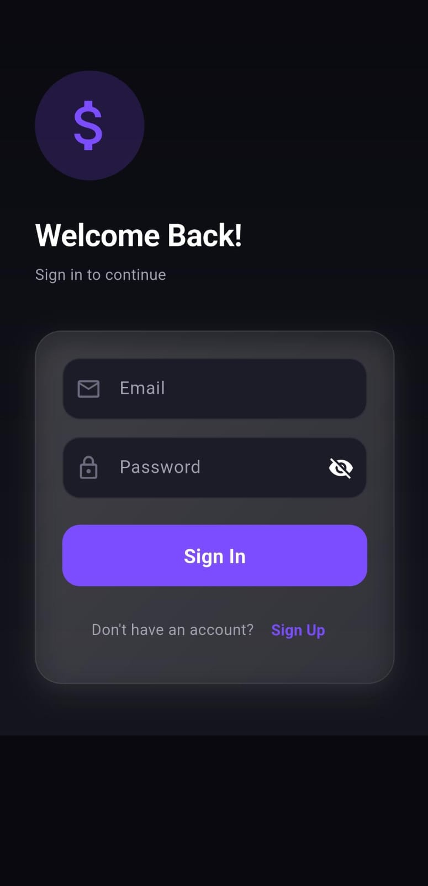
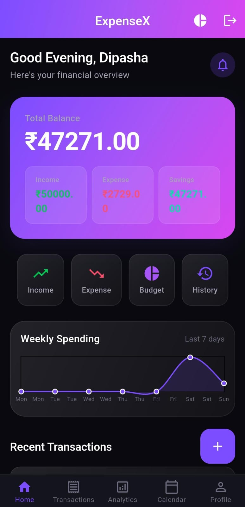
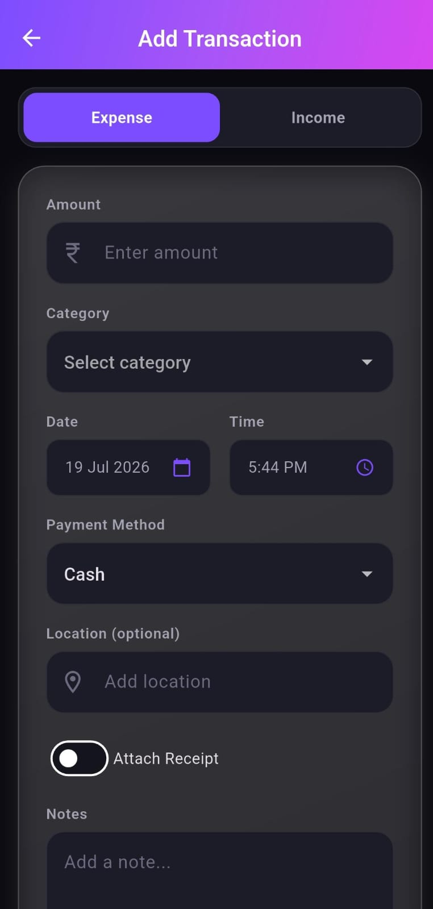
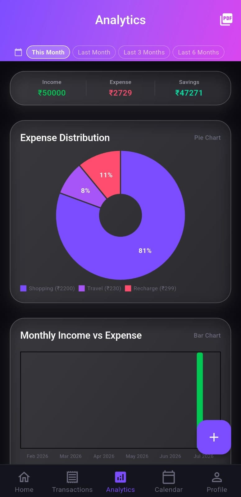
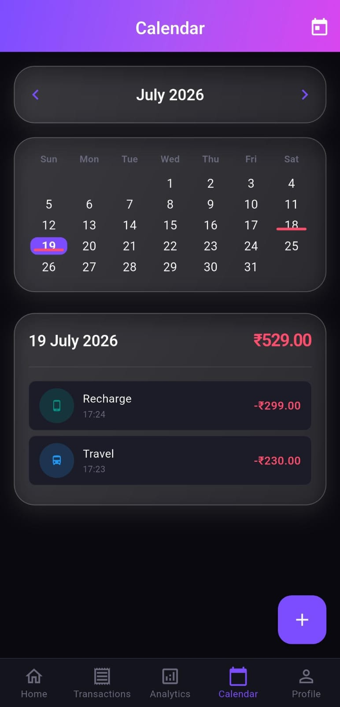
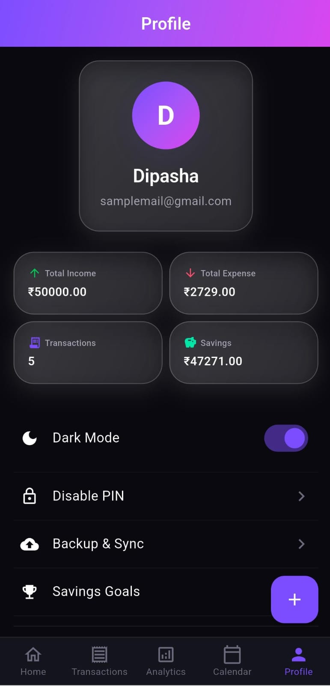

# 💰 ExpenseX – Smart Finance Tracker

ExpenseX is a full-featured expense tracking and budget management application built with Flutter and Firebase. It provides real-time financial insights with a modern, premium dark/light themed UI.

## 📱 Features

### Core Functionality
- **Authentication** – Email/Password signup and login with persistent session
- **Dashboard** – Real-time balance, income, expense, savings, and weekly spending chart
- **Transactions** – Add income/expense with categories, subcategories, date, time, payment method, location, notes, and tags
- **Transaction List** – Search, filter by type/category, sort, and swipe to delete
- **Analytics** – Pie chart (expense distribution), bar chart (monthly income vs expense), line chart (daily spending), and top spending categories
- **PDF Export** – Generate and share monthly financial reports as PDF
- **Calendar** – Monthly view with transaction dots and daily transaction list
- **Budget Planner** – Set monthly budgets per category with progress bars and over-budget warnings
- **Savings Goals** – Set, track, and manage financial goals with progress indicators
- **Profile** – User avatar, statistics, theme toggle, PIN lock, backup & sync, and logout

### Security & Personalization
- **Dark / Light Mode** – Toggle and persist theme preference
- **PIN Lock** – 4-digit PIN with verification on app launch and resume

### Data Management
- **Cloud Sync** – Real-time data synchronization with Firebase Firestore
- **Backup & Export** – Export transactions, budgets, and goals as JSON

## 🛠️ Tech Stack

| Technology | Purpose |
|------------|---------|
| Flutter (Dart) | Cross-platform UI framework |
| Firebase Auth | User authentication |
| Firebase Firestore | Real-time cloud database |
| Provider | State management |
| SharedPreferences | Local session storage |
| fl_chart | Charts and analytics |
| pdf / printing | PDF report generation |
| share_plus | File sharing |

## 📁 Project Structure
lib/
├── main.dart
├── models/ # Data models (Transaction, Budget, Goal, User)
├── screens/ # All UI screens (Login, Home, Analytics, etc.)
├── services/ # Firebase and business logic services
├── providers/ # Theme provider
└── utils/ # Constants and categories

## 🚀 Getting Started

### Prerequisites
- Flutter SDK (>=3.22)
- Firebase account

### Installation

1. Clone the repository:
   git clone https://github.com/Dipasha-01/expense-tracker-budget-planner.git
   cd expense-tracker-budget-planner
2. Install dependencies:
   flutter pub get
3. Configure Firebase:
   i.Create a Firebase project
   ii.Enable Email/Password Authentication
   iii.Create Firestore database in test mode
   iv.Add Android app with package name com.example.expense_tracker_fresh
   v.Download google-services.json and place it in android/app/
4. Run the app:
   flutter run

## 📸 Screenshots

| Login | Dashboard | Add Transaction |
|:-----:|:---------:|:---------------:|
|  |  |  |

| Analytics | Calendar | Profile |
|:---------:|:--------:|:-------:|
|  |  |  |

## 👨‍💻 Developer
**Dipasha**  
GitHub: [Dipasha-01](https://github.com/Dipasha-01)  
Project Link: [expense-tracker-budget-planner](https://github.com/Dipasha-01/expense-tracker-budget-planner)

## 📄 License

This project is developed as part of an internship training program.

---
**Made with ❤️ and Flutter**
     
   
   
